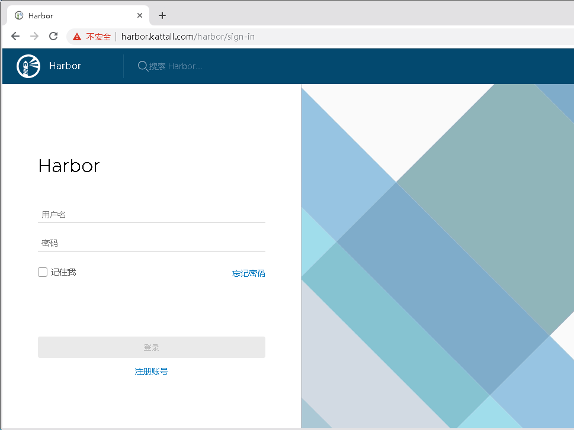
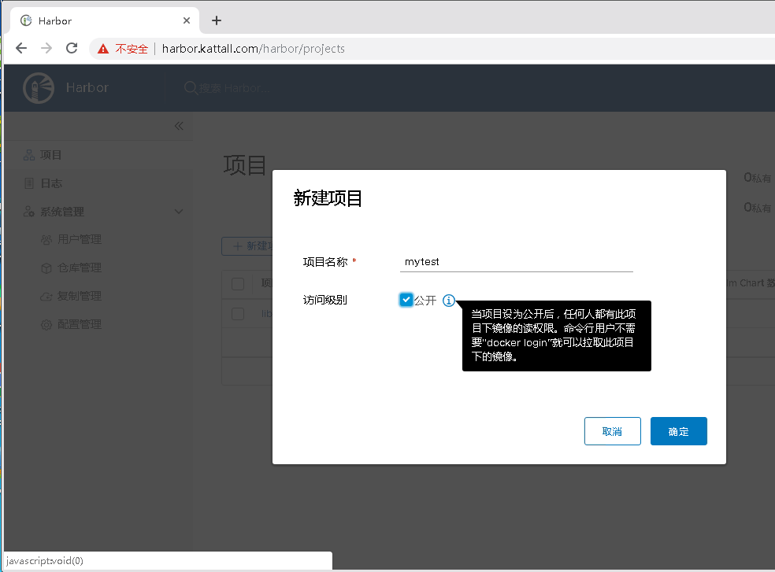
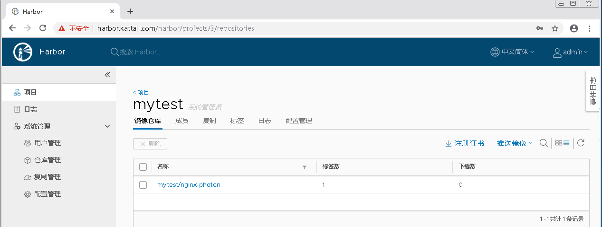
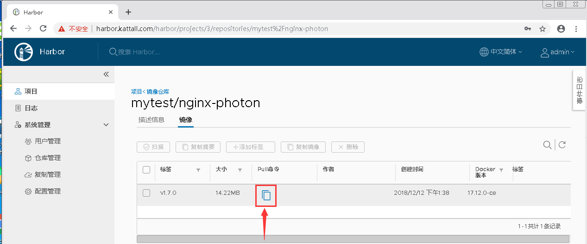

# Kubernetes集群搭建之企业级环境中基于Harbor搭建自己的私有仓库

## 搭建背景

企业环境中使用Docker环境，一般出于安全考虑，业务使用的镜像一般不会从第三方公共仓库下载。那么就要引出今天的主题

> 企业级环境中基于Harbor搭建自己的安全认证仓库

## 介绍

* 名称：Harbor 
* 官网：https://github.com/vmware/harbor 
* 简介：Harbor是一个用于存储和分发Docker镜像的企业级Registry服务器，通过添加一些企业必需的功能特性，例如安全、标识和管理等，扩展了开源Docker Distribution。作为一个企业级私有Registry服务器，Harbor提供了更好的性能和安全。提升用户使用Registry构建和运行环境传输镜像的效率。Harbor支持安装在多个Registry节点的镜像资源复制，镜像全部保存在私有Registry中， 确保数据和知识产权在公司内部网络中管控。另外，Harbor也提供了高级的安全特性，诸如用户管理，访问控制和活动审计等。

## 部署Harbor

Harbor是基于Docker-Compose进行编排的,需要配合Docker和Docker-compose使用。

## 下载Docker-Compose

> docker-compose工具在git上, kubernetes/bin/docker-compose下. 也可以直接使用.
```
[root@harbor ~]# curl -L https://github.com/docker/compose/releases/download/1.13.0/docker-compose-`uname -s`-`uname -m` > /usr/local/bin/docker-compose
[root@harbor ~]# chmod +x /usr/local/bin/docker-compose
[root@harbor ~]# docker-compose --version
docker-compose version 1.13.0, build 1719ceb
```
> ps: 可能会报错Peer reports incompatible or unsupported protocol version.，升级下curl就行

## 修改配置(准备好安装包：harbor-online-installer-v1.7.0.tgz)

> harbor-online-installer-v1.7.0.tgz工具在git上, kubernetes/package/harbor-online-installer-v1.7.0.tgz下.

```
[root@harbor ~]# cd kubernetes/package/
[root@harbor package]# tar xf harbor-online-installer-v1.7.0.tgz -C /data/app/
[root@harbor package]# cd /data/app/harbor/

# 只修改hostname字段, 其他字段建议不修改, 可能导致harbor启动报错。
[root@harbor ~]# vim harbor.cfg
hostname = harbor.kattall.com       # 本机外网IP或域名，该地址供用户通过UI进行访问，不要使用127.0.0.1
ui_url_protocol = http              # 用户访问私仓时使用的协议，默认时http
db_password = root123 　　          # 指定mysql数据库管理员密码
harbor_admin_password：Harbor12345  # harbor的管理员账户密码
```

## 通过官方一键脚本安装

因为这个是在线安装, 会把所有镜像拉取下来，需要等待点时间。
```
[root@harbor harbor]# ./install.sh 

[Step 0]: checking installation environment ...
Note: docker version: 18.09.5
Note: docker-compose version: 1.13.0

[Step 1]: preparing environment ...
Generated and saved secret to file: /data/secretkey
Generated configuration file: ./common/config/nginx/nginx.conf
Generated configuration file: ./common/config/adminserver/env
Generated configuration file: ./common/config/core/env
Generated configuration file: ./common/config/registry/config.yml
Generated configuration file: ./common/config/db/env
Generated configuration file: ./common/config/jobservice/env
Generated configuration file: ./common/config/jobservice/config.yml
Generated configuration file: ./common/config/log/logrotate.conf
Generated configuration file: ./common/config/registryctl/env
Generated configuration file: ./common/config/core/app.conf

...

Creating harbor-log ... 
Creating harbor-log ... done
Creating redis ... 
Creating harbor-adminserver ... 
Creating registry ... 
Creating registryctl ... 
Creating harbor-db ... 
Creating redis
Creating harbor-db
Creating registry
Creating harbor-adminserver
Creating registry ... done
Creating harbor-core ... 
Creating harbor-core ... done
Creating harbor-portal ... 
Creating harbor-portal
Creating harbor-jobservice ... 
Creating harbor-portal ... done
Creating nginx ... 
Creating nginx ... done

✔ ----Harbor has been installed and started successfully.----

Now you should be able to visit the admin portal at http://harbor.kattall.com. 
For more details, please visit https://github.com/goharbor/harbor .


[root@harbor harbor]# docker-compose ps
       Name                     Command               State                                Ports                               
------------------------------------------------------------------------------------------------------------------------------
harbor-adminserver   /harbor/start.sh                 Up                                                                       
harbor-core          /harbor/start.sh                 Up                                                                       
harbor-db            /entrypoint.sh postgres          Up      5432/tcp                                                         
harbor-jobservice    /harbor/start.sh                 Up                                                                       
harbor-log           /bin/sh -c /usr/local/bin/ ...   Up      127.0.0.1:1514->10514/tcp                                        
harbor-portal        nginx -g daemon off;             Up      80/tcp                                                           
nginx                nginx -g daemon off;             Up      0.0.0.0:443->443/tcp, 0.0.0.0:4443->4443/tcp, 0.0.0.0:80->80/tcp 
redis                docker-entrypoint.sh redis ...   Up      6379/tcp                                                         
registry             /entrypoint.sh /etc/regist ...   Up      5000/tcp                                                         
registryctl          /harbor/start.sh                 Up 
```

## 测试登录

```
[root@harbor harbor]# docker login harbor.kattall.com
Username: admin
Password: 
WARNING! Your password will be stored unencrypted in /root/.docker/config.json.
Configure a credential helper to remove this warning. See
https://docs.docker.com/engine/reference/commandline/login/#credentials-store

Login Succeeded
```

在windows上用域名访问需要绑定hosts即可.
> 默认账号： admin   密码： Harbor12345



## 使用


我这里创建个mytest的公开项目做测试（不使用默认的library）。公开项目pull不需要登录，push需要登录

接下来我们试下推个镜像到Harbor的mytest项目中，这里我以公共镜像goharbor/nginx-photon:v1.7.0镜像为例 ，需要注意的是要往私有仓库推镜像就得打个tag才行 指明要推往哪个仓库并标注标签
```
[root@harbor harbor]# docker images
REPOSITORY                    TAG                 IMAGE ID            CREATED             SIZE
goharbor/redis-photon         v1.7.0              8adff755797f        4 months ago        96.1MB
goharbor/harbor-registryctl   v1.7.0              1906a8b84fa5        4 months ago        101MB
goharbor/registry-photon      v2.6.2-v1.7.0       677f21b09362        4 months ago        86.4MB
goharbor/nginx-photon         v1.7.0              6ed96fc73f83        4 months ago        35.5MB
goharbor/harbor-log           v1.7.0              722fa4a77846        4 months ago        81MB
goharbor/harbor-jobservice    v1.7.0              effd390c0cd4        4 months ago        83.8MB
goharbor/harbor-core          v1.7.0              2ebd58ce5638        4 months ago        95.2MB
goharbor/harbor-portal        v1.7.0              72a291f86bab        4 months ago        40.2MB
goharbor/harbor-adminserver   v1.7.0              9f850341a571        4 months ago        72MB
goharbor/harbor-db            v1.7.0              45d94fe5fee5        4 months ago        133MB
[root@harbor harbor]# docker tag goharbor/nginx-photon:v1.7.0 harbor.kattall.com/mytest/nginx-photon:v1.7.0
[root@harbor harbor]# docker push harbor.kattall.com/mytest/nginx-photon:v1.7.0
The push refers to repository [harbor.kattall.com/mytest/nginx-photon]
eb5a3a0dbc61: Pushed 
93e951af0370: Pushed 
v1.7.0: digest: sha256:4e6739f6662e1df7df47c7eaca12b63d3ac57fd207809cee725f7f5a797274c9 size: 739
```

可以看到push成功，我们去页面上看看


## pull演示

点击镜像详情可以看到具体标签版本，鼠标放在"pull命令"图标上可以获取命令


```
[root@harbor harbor]# docker pull harbor.kattall.com/mytest/nginx-photon:v1.7.0
v1.7.0: Pulling from mytest/nginx-photon
Digest: sha256:4e6739f6662e1df7df47c7eaca12b63d3ac57fd207809cee725f7f5a797274c9
Status: Image is up to date for harbor.kattall.com/mytest/nginx-photon:v1.7.0
```

> 本篇介绍了Harbor的基本部署和使用，更多高级使用方法后续会分享。


