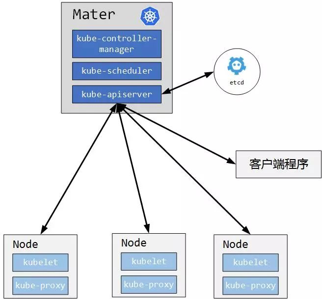

# Kubernetes集群搭建之Etcd集群配置篇

## 介绍

>etcd 是一个分布式一致性k-v存储系统，可用于服务注册发现与共享配置，具有以下优点。
* 简单： 相比于晦涩难懂的paxos算法，etcd基于相对简单且易实现的raft算法实现一致性，并通过gRPC提供接口调用 
* 安全：支持TLS通信，并可以针对不同的用户进行对key的读写控制 
* 高性能：10,000 /秒的写性能

注: K8s的集群相关数据是存放在Etcd中的,所有我们得先部署




## cfssl安装(master01操作即可)

Kubernetes 系统的各组件需要使用 TLS 证书对通信进行加密，使用 CloudFlare 的 PKI 工具集 cfssl 来生成 Certificate Authority (CA) 和其它证书。

> cfssl.sh工具在git上, kubernetes/package/cfssl.sh下.
```
[root@master01 ~]# cd kubernetes/package/
[root@master01 ~]# sh cfssl.sh 
wget https://pkg.cfssl.org/R1.2/cfssl_linux-amd64
wget https://pkg.cfssl.org/R1.2/cfssljson_linux-amd64
wget https://pkg.cfssl.org/R1.2/cfssl-certinfo_linux-amd64
chmod +x cfssl_linux-amd64 cfssljson_linux-amd64 cfssl-certinfo_linux-amd64
mv cfssl_linux-amd64 /usr/local/bin/cfssl
mv cfssljson_linux-amd64 /usr/local/bin/cfssljson
mv cfssl-certinfo_linux-amd64 /usr/bin/cfssl-certinfo
```


## 创建证书目录

```
# 所有服务器都需要创建这个目录(除harbor), 存放证书
[root@master-01 ~]# mkdir /etc/etcd/ssl -p
[root@master-01 ~]# mkdir /etc/kubernetes/ssl -p
[root@master-01 ~]# cd /etc/etcd/ssl
```

## 生成证书

1. etcd ca 配置
```
[root@master01 ssl]# more ca-config.json
{
	"signing": {
		"default": {
			"expiry": "87600h"
		},
		"profiles": {
			"etcd": {
				"expiry": "87600h",
				"usages": [
					"signing",
					"key encipherment",
					"server auth",
					"client auth"
				]
			}
		}
	}
}
```

2. etcd ca 证书
```
[root@master01 ssl]# more ca-csr.json
{
	"CN": "etcd CA",
	"key": {
		"algo": "rsa",
		"size": 2048
	},
	"names": [{
		"C": "CN",
		"L": "Hangzhou",
		"ST": "Hangzhou"
	}]
}
```

3. etcd server 证书
```
[root@master01 ssl]# more server-csr.json
{
	"CN": "etcd",
	"hosts": [
		"192.168.1.161",
		"192.168.1.162",
		"192.168.1.163"
	],
	"key": {
		"algo": "rsa",
		"size": 2048
	},
	"names": [{
		"C": "CN",
		"L": "Hangzhou",
		"ST": "Hangzhou"
	}]
}
```

4. 生成etcd ca证书和私钥, 初始化ca
```
[root@master01 ssl]# ls
ca-config.json  ca-csr.json  server-csr.json
[root@master01 ssl]# cfssl gencert -initca ca-csr.json | cfssljson -bare ca
2019/05/07 17:35:16 [INFO] generating a new CA key and certificate from CSR
2019/05/07 17:35:16 [INFO] generate received request
2019/05/07 17:35:16 [INFO] received CSR
2019/05/07 17:35:16 [INFO] generating key: rsa-2048
2019/05/07 17:35:17 [INFO] encoded CSR
2019/05/07 17:35:17 [INFO] signed certificate with serial number 123767024460273654629890239305496836799203323210
[root@master01 ssl]# ls
ca-config.json  ca.csr  ca-csr.json  ca-key.pem  ca.pem  server-csr.json
```

5. 生成server 证书
```
[root@master01 ssl]# cfssl gencert -ca=ca.pem -ca-key=ca-key.pem -config=ca-config.json -profile=etcd server-csr.json | cfssljson -bare server
2019/05/07 17:35:53 [INFO] generate received request
2019/05/07 17:35:53 [INFO] received CSR
2019/05/07 17:35:53 [INFO] generating key: rsa-2048
2019/05/07 17:35:55 [INFO] encoded CSR
2019/05/07 17:35:55 [INFO] signed certificate with serial number 680723003373461404953523820798068969484941044074
2019/05/07 17:35:55 [WARNING] This certificate lacks a "hosts" field. This makes it unsuitable for
websites. For more information see the Baseline Requirements for the Issuance and Management
of Publicly-Trusted Certificates, v.1.1.6, from the CA/Browser Forum (https://cabforum.org);
specifically, section 10.2.3 ("Information Requirements").
[root@master01 ssl]# ls
ca-config.json  ca.csr  ca-csr.json  ca-key.pem  ca.pem  server.csr  server-csr.json  server-key.pem  server.pem
```

以上生成etcd证书完成，只需要会使用即可，不用过多深入研究

## 同步证书

拷贝证书到 master02, master03, node01, node02上
```
[root@master01 ssl]# scp -rp * root@master02:/etc/etcd/ssl/
[root@master01 ssl]# scp -rp * root@master03:/etc/etcd/ssl/
[root@master01 ssl]# scp -rp * root@node01:/etc/etcd/ssl/
[root@master01 ssl]# scp -rp * root@node02:/etc/etcd/ssl/
```

## etcd部署

1. 解压缩并同步二进制文件到 master02、master03
```
[root@master01 package]# pwd
/root/kubernetes/package/
[root@master01 package]# tar xf etcd-v3.3.12-linux-amd64.tar.gz
[root@master01 package]# cd etcd-v3.3.12-linux-amd64
[root@master01 etcd-v3.3.12-linux-amd64]# cp etcd etcdctl /usr/bin/
[root@master01 etcd-v3.3.12-linux-amd64]# scp -rp etcd etcdctl root@master02:/usr/bin/  
[root@master01 etcd-v3.3.12-linux-amd64]# scp -rp etcd etcdctl root@master03:/usr/bin/
```

2. 创建etcd数据目录(三台etcd都需要创建此目录)
```
[root@master01 ~]# mkdir /var/lib/etcd
```

3. 配置etcd文件
```
[root@master01 etcd]# more etcd.conf 
# configure file for etcd.service
#[Member]
ETCD_NAME="infra1" 
ETCD_DATA_DIR="/var/lib/etcd/infra1.etcd"
ETCD_LISTEN_PEER_URLS="https://0.0.0.0:2380"
ETCD_LISTEN_CLIENT_URLS="https://0.0.0.0:2379"

#[Clustering]
ETCD_INITIAL_ADVERTISE_PEER_URLS="https://192.168.1.161:2380"
ETCD_ADVERTISE_CLIENT_URLS="https://192.168.1.161:2379"
ETCD_INITIAL_CLUSTER="infra1=https://192.168.1.161:2380,infra2=https://192.168.1.162:2380,infra3=https://192.168.1.163:2380"
ETCD_INITIAL_CLUSTER_TOKEN="etcd-cluster"
ETCD_INITIAL_CLUSTER_STATE="new"

#[Security]
ETCD_CERT_FILE="/etc/etcd/ssl/server.pem"
ETCD_KEY_FILE="/etc/etcd/ssl/server-key.pem"
ETCD_TRUSTED_CA_FILE="/etc/etcd/ssl/ca.pem"
ETCD_CLIENT_CERT_AUTH="true"
ETCD_PEER_CERT_FILE="/etc/etcd/ssl/server.pem"
ETCD_PEER_KEY_FILE="/etc/etcd/ssl/server-key.pem"
ETCD_PEER_TRUSTED_CA_FILE="/etc/etcd/ssl/ca.pem"
ETCD_PEER_CLIENT_CERT_AUTH="true"

ETCD_PEER_CERT_FILE="/etc/etcd/ssl/server.pem"
ETCD_PEER_KEY_FILE="/etc/etcd/ssl/server-key.pem"
ETCD_PEER_TRUSTED_CA_FILE="/etc/etcd/ssl/ca.pem"
ETCD_PEER_CLIENT_CERT_AUTH="true"
```

ETCD_NAME 节点名称 \
ETCD_DATA_DIR 数据目录 \
ETCD_LISTEN_PEER_URLS 集群通信监听地址 \
ETCD_LISTEN_CLIENT_URLS 客户端访问监听地址 \
ETCD_INITIAL_ADVERTISE_PEER_URLS 集群通告地址 \
ETCD_ADVERTISE_CLIENT_URLS 客户端通告地址 \
ETCD_INITIAL_CLUSTER 集群节点地址 \
ETCD_INITIAL_CLUSTER_TOKEN 集群Token \
ETCD_INITIAL_CLUSTER_STATE 加入集群的当前状态，new是新集群，existing表示加入已有集群 \
> 注意:  master02、master03节点上需要修改ETCD_NAME 和对应IP地址

4. 配置etcd启动文件
```
[root@master01 etcd]# more /usr/lib/systemd/system/etcd.service
[Unit]
Description=Etcd Server
After=network.target
After=network-online.target
Wants=network-online.target

[Service]
Type=notify
WorkingDirectory=/var/lib/etcd/
EnvironmentFile=-/etc/etcd/etcd.conf
# set GOMAXPROCS to number of processors
ExecStart=/bin/bash -c "GOMAXPROCS=$(nproc) /usr/bin/etcd --name=\"${ETCD_NAME}\" --data-dir=\"${ETCD_DATA_DIR}\" --listen-client-urls=\"${ETCD_LISTEN_CLIENT_URLS}\" --
listen-peer-urls=\"${ETCD_LISTEN_PEER_URLS}\" --advertise-client-urls=\"${ETCD_ADVERTISE_CLIENT_URLS}\" --initial-cluster-token=\"${ETCD_INITIAL_CLUSTER_TOKEN}\" --init
ial-cluster=\"${ETCD_INITIAL_CLUSTER}\" --initial-cluster-state=\"${ETCD_INITIAL_CLUSTER_STATE}\" --cert-file=\"${ETCD_CERT_FILE}\" --key-file=\"${ETCD_KEY_FILE}\" --tr
usted-ca-file=\"${ETCD_TRUSTED_CA_FILE}\" --client-cert-auth=\"${ETCD_CLIENT_CERT_AUTH}\" --peer-cert-file=\"${ETCD_PEER_CERT_FILE}\" --peer-key-file=\"${ETCD_PEER_KEY_
FILE}\" --peer-trusted-ca-file=\"${ETCD_PEER_TRUSTED_CA_FILE}\" --peer-client-cert-auth=\"${ETCD_PEER_CLIENT_CERT_AUTH}\""
Restart=on-failure
LimitNOFILE=65536

[Install]
WantedBy=multi-user.target
```

5. 同步配置文件及启动文件到master02, master03
```
[root@master01 etcd]# scp -rp etcd.conf  root@master02:/etc/etcd/
[root@master01 etcd]# scp -rp etcd.conf  root@master03:/etc/etcd/

[root@master01 etcd]# scp -rp /usr/lib/systemd/system/etcd.service root@master02:/usr/lib/systemd/system/
[root@master01 etcd]# scp -rp /usr/lib/systemd/system/etcd.service root@master03:/usr/lib/systemd/system/
```

6. 修改master02 master03中 etcd.conf配置文件

```
[root@master02 ~]# more /etc/etcd/etcd.conf 
# configure file for etcd.service
#[Member]
ETCD_NAME="infra2" 
ETCD_DATA_DIR="/var/lib/etcd/infra2.etcd"
ETCD_LISTEN_PEER_URLS="https://0.0.0.0:2380"
ETCD_LISTEN_CLIENT_URLS="https://0.0.0.0:2379"

#[Clustering]
ETCD_INITIAL_ADVERTISE_PEER_URLS="https://192.168.1.162:2380"
ETCD_ADVERTISE_CLIENT_URLS="https://192.168.1.162:2379"
ETCD_INITIAL_CLUSTER="infra1=https://192.168.1.161:2380,infra2=https://192.168.1.162:2380,infra3=https://192.168.1.163:2380"
ETCD_INITIAL_CLUSTER_TOKEN="etcd-cluster"
ETCD_INITIAL_CLUSTER_STATE="new"

#[Security]
ETCD_CERT_FILE="/etc/etcd/ssl/server.pem"
ETCD_KEY_FILE="/etc/etcd/ssl/server-key.pem"
ETCD_TRUSTED_CA_FILE="/etc/etcd/ssl/ca.pem"
ETCD_CLIENT_CERT_AUTH="true"
ETCD_PEER_CERT_FILE="/etc/etcd/ssl/server.pem"
ETCD_PEER_KEY_FILE="/etc/etcd/ssl/server-key.pem"
ETCD_PEER_TRUSTED_CA_FILE="/etc/etcd/ssl/ca.pem"
ETCD_PEER_CLIENT_CERT_AUTH="true"

ETCD_PEER_CERT_FILE="/etc/etcd/ssl/server.pem"
ETCD_PEER_KEY_FILE="/etc/etcd/ssl/server-key.pem"
ETCD_PEER_TRUSTED_CA_FILE="/etc/etcd/ssl/ca.pem"
ETCD_PEER_CLIENT_CERT_AUTH="true"

[root@master03 ~]# more /etc/etcd/etcd.conf 
# configure file for etcd.service
#[Member]
ETCD_NAME="infra3" 
ETCD_DATA_DIR="/var/lib/etcd/infra3.etcd"
ETCD_LISTEN_PEER_URLS="https://0.0.0.0:2380"
ETCD_LISTEN_CLIENT_URLS="https://0.0.0.0:2379"

#[Clustering]
ETCD_INITIAL_ADVERTISE_PEER_URLS="https://192.168.1.163:2380"
ETCD_ADVERTISE_CLIENT_URLS="https://192.168.1.163:2379"
ETCD_INITIAL_CLUSTER="infra1=https://192.168.1.161:2380,infra2=https://192.168.1.162:2380,infra3=https://192.168.1.163:2380"
ETCD_INITIAL_CLUSTER_TOKEN="etcd-cluster"
ETCD_INITIAL_CLUSTER_STATE="new"

#[Security]
ETCD_CERT_FILE="/etc/etcd/ssl/server.pem"
ETCD_KEY_FILE="/etc/etcd/ssl/server-key.pem"
ETCD_TRUSTED_CA_FILE="/etc/etcd/ssl/ca.pem"
ETCD_CLIENT_CERT_AUTH="true"
ETCD_PEER_CERT_FILE="/etc/etcd/ssl/server.pem"
ETCD_PEER_KEY_FILE="/etc/etcd/ssl/server-key.pem"
ETCD_PEER_TRUSTED_CA_FILE="/etc/etcd/ssl/ca.pem"
ETCD_PEER_CLIENT_CERT_AUTH="true"

ETCD_PEER_CERT_FILE="/etc/etcd/ssl/server.pem"
ETCD_PEER_KEY_FILE="/etc/etcd/ssl/server-key.pem"
ETCD_PEER_TRUSTED_CA_FILE="/etc/etcd/ssl/ca.pem"
ETCD_PEER_CLIENT_CERT_AUTH="true"

```

7. 启动etcd
```
[root@master-01 ssl]# systemctl daemon-reload
[root@master-01 ssl]# systemctl enable etcd
[root@master-01 ssl]# systemctl start etcd
[root@master01 etcd]# systemctl status etcd
● etcd.service - Etcd Server
   Loaded: loaded (/usr/lib/systemd/system/etcd.service; disabled; vendor preset: disabled)
   Active: active (running) since Tue 2019-05-07 17:58:36 CST; 5s ago
 Main PID: 27912 (etcd)
    Tasks: 13
   Memory: 12.4M
   CGroup: /system.slice/etcd.service
           └─27912 /usr/bin/etcd --name=infra1 --data-dir=/var/lib/etcd/infra1.etcd --listen-client-urls=https://0.0.0.0:2379 --listen-peer-urls=https://0.0.0.0:2380...

May 07 17:58:36 master01 etcd[27912]: a7ea2df634f83903 [logterm: 1, index: 3, vote: 0] cast MsgVote for 36c90395130636a0 [logterm: 3, index: 7] at term 62
May 07 17:58:36 master01 etcd[27912]: raft.node: a7ea2df634f83903 elected leader 36c90395130636a0 at term 62
May 07 17:58:36 master01 etcd[27912]: set the initial cluster version to 3.0
May 07 17:58:36 master01 etcd[27912]: enabled capabilities for version 3.0
May 07 17:58:36 master01 etcd[27912]: published {Name:infra1 ClientURLs:[https://192.168.1.161:2379]} to cluster a03879f0e2013b2a
May 07 17:58:36 master01 etcd[27912]: ready to serve client requests
May 07 17:58:36 master01 systemd[1]: Started Etcd Server.
May 07 17:58:36 master01 etcd[27912]: serving client requests on [::]:2379
May 07 17:58:36 master01 etcd[27912]: updated the cluster version from 3.0 to 3.3
May 07 17:58:36 master01 etcd[27912]: enabled capabilities for version 3.3
```

8. 验证集群状态
```
[root@master01 etcd]# etcdctl --ca-file=/etc/etcd/ssl/ca.pem --cert-file=/etc/etcd/ssl/server.pem --key-file=/etc/etcd/ssl/server-key.pem --endpoints="https://192.168.1.161:2379,https://192.168.1.162:2379,https://192.168.1.163:2379" cluster-health
member 36c90395130636a0 is healthy: got healthy result from https://192.168.1.162:2379
member 3d0dd94ff1cef0dc is healthy: got healthy result from https://192.168.1.163:2379
member a7ea2df634f83903 is healthy: got healthy result from https://192.168.1.161:2379
cluster is healthy
```

进行到这一步，说明etcd集群部署完成啦

