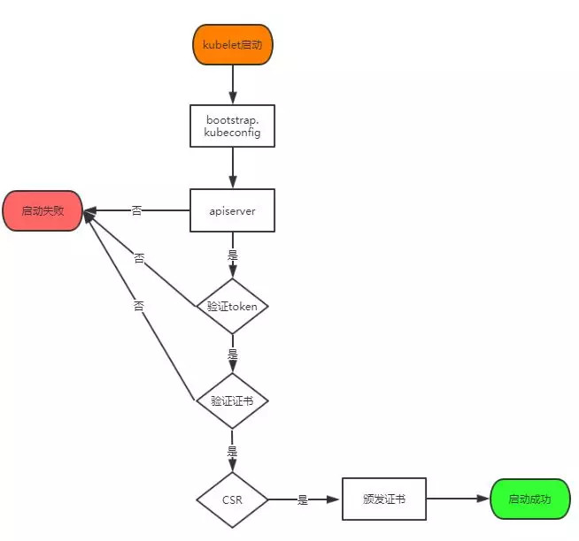
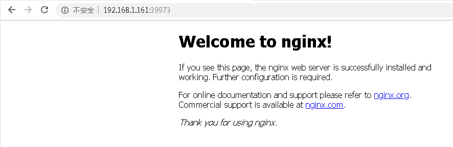

# Kubernetes集群搭建之Node配置篇

## 部署Node组件

> Master apiserver启用TLS认证后，Node节点kubelet组件想要加入集群，必须使用CA签发的有效证书才能与apiserver通信，当Node节点很多时，签署证书是一件很繁琐的事情，因此有了TLS Bootstrapping机制，kubelet会以一个低权限用户自动向apiserver申请证书，kubelet的证书由apiserver动态签署。

认证大致工作流程如图所示：



将kube-bootstrap用户绑定到系统集群角色, master上操作(只需要执行这一次)
```
[root@master01 kubernetes]# kubectl create clusterrolebinding kubelet-bootstrap --clusterrole=system:node-bootstrapper --user=kubelet-bootstrap

如果需要权限最大需要执行：
[root@master01 kubernetes]# kubectl create clusterrolebinding kubelet-bootstrap --clusterrole=cluster-admin --user=kubelet-bootstrap


[root@master01 kubernetes]# kubectl create clusterrolebinding system:anonymous --clusterrole=cluster-admin --user=system:anonymous
```

创建kubelet bootstrap kubeconfig文件， 通过脚本实现.
```
[root@master01 ~]# cd kubernetes/package/
[root@master01 package]# cp -rp environment.sh  /etc/kubernetes/

# 修改bootstrap_token 和 kube_apiserver
[root@master01 kubernetes]# more environment.sh 
#!/bin/bash
#创建kubelet bootstrapping kubeconfig 
BOOTSTRAP_TOKEN=e3d7a665fd20d6ea217e33c34f122bcf
#设置客户端认证参数
KUBE_APISERVER="https://192.168.1.161:6443"
#设置集群参数
kubectl config set-cluster kubernetes \
--certificate-authority=/etc/kubernetes/ssl/ca.pem \
--embed-certs=true \
--server=${KUBE_APISERVER} \
--kubeconfig=bootstrap.kubeconfig

#设置客户端认证参数
kubectl config set-credentials kubelet-bootstrap \
--token=${BOOTSTRAP_TOKEN} \
--kubeconfig=bootstrap.kubeconfig

# 设置上下文参数
kubectl config set-context default \
--cluster=kubernetes \
--user=kubelet-bootstrap \
--kubeconfig=bootstrap.kubeconfig

# 设置默认上下文
kubectl config use-context default --kubeconfig=bootstrap.kubeconfig

#----------------------

# 创建kube-proxy kubeconfig文件

kubectl config set-cluster kubernetes \
--certificate-authority=/etc/kubernetes/ssl/ca.pem \
--embed-certs=true \
--server=${KUBE_APISERVER} \
--kubeconfig=kube-proxy.kubeconfig

kubectl config set-credentials kube-proxy \
--client-certificate=/etc/kubernetes/ssl/kube-proxy.pem \
--client-key=/etc/kubernetes/ssl/kube-proxy-key.pem \
--embed-certs=true \
--kubeconfig=kube-proxy.kubeconfig

kubectl config set-context default \
--cluster=kubernetes \
--user=kube-proxy \
--kubeconfig=kube-proxy.kubeconfig

kubectl config use-context default --kubeconfig=kube-proxy.kubeconfig
```

执行创建操作
```
[root@master01 kubernetes]# sh environment.sh 
Cluster "kubernetes" set.
User "kubelet-bootstrap" set.
Context "default" created.
Switched to context "default".
Cluster "kubernetes" set.
User "kube-proxy" set.
Context "default" created.
Switched to context "default".
```
注意: 将生成的bootstrap.kubeconfig  kube-proxy.kubeconfig两个文件拷贝到Node节点/etc/kubernetes/目录下。(只要装node组件都需要这个文件)

创建kubelet.config文件
```
[root@master01 kubernetes]# more kubelet.config 
kind: KubeletConfiguration
apiVersion: kubelet.config.k8s.io/v1beta1
address: 192.168.1.161
port: 10250
readOnlyPort: 10255
cgroupDriver: cgroupfs
clusterDNS: ["10.254.0.10"]
clusterDomain: cluster.local.
failSwapOn: false
authentication:
  anonymous:
    enabled: true
  webhook:
    enabled: false

[root@master01 kubernetes]# scp -rp bootstrap.kubeconfig kube-proxy.kubeconfig kubelet.config root@master02:/etc/kubernetes/
[root@master01 kubernetes]# scp -rp bootstrap.kubeconfig kube-proxy.kubeconfig kubelet.config root@master03:/etc/kubernetes/
[root@master01 kubernetes]# scp -rp bootstrap.kubeconfig kube-proxy.kubeconfig kubelet.config root@node01:/etc/kubernetes/
[root@master01 kubernetes]# scp -rp bootstrap.kubeconfig kube-proxy.kubeconfig kubelet.config root@node02:/etc/kubernetes/
```

1. 部署kubelet


解压node配置文件
```
[root@master01 package]# tar xf kubernetes-node-linux-amd64.tar.gz
[root@master01 package]# cd kubernetes/node/bin/
[root@master01 bin]# ls
kubeadm  kubectl  kubelet  kube-proxy
[root@master01 bin]# scp -rp kubeadm  kubectl  kubelet  kube-proxy root@node01:/usr/bin/
[root@master01 bin]# scp -rp kubeadm  kubectl  kubelet  kube-proxy root@node02:/usr/bin/
```

创建kubelet配置文件
```
[root@master01 kubernetes]# more kubelet
KUBELET_OPTS="--logtostderr=true \
--v=4 \
--hostname-override=192.168.1.161 \
--kubeconfig=/etc/kubernetes/kubelet.kubeconfig \
--bootstrap-kubeconfig=/etc/kubernetes/bootstrap.kubeconfig \
--config=/etc/kubernetes/kubelet.config \
--cert-dir=/etc/kubernetes/ssl \
--pod-infra-container-image=harbor.kattall.com/library/pod-infrastructure:latest"
```

* --hostname-override 在集群中显示的主机名
* --kubeconfig 指定kubeconfig文件位置，会自动生成
* --bootstrap-kubeconfig 指定刚才生成的bootstrap.kubeconfig文件
* --cert-dir 颁发证书存放位置
* --pod-infra-container-image 管理Pod网络的镜像

创建kubelet启动文件
```
[root@master01 kubernetes]# more /usr/lib/systemd/system/kubelet.service
[Unit]
Description=Kubernetes Kubelet
After=docker.service
Requires=docker.service

[Service]
EnvironmentFile=/etc/kubernetes/kubelet
ExecStart=/usr/bin/kubelet $KUBELET_OPTS
Restart=on-failure
KillMode=process

[Install]
WantedBy=multi-user.target
```

启动服务
```
[root@master01 kubernetes]# systemctl daemon-reload
[root@master01 kubernetes]# systemctl enable kubelet 
Created symlink from /etc/systemd/system/multi-user.target.wants/kubelet.service to /usr/lib/systemd/system/kubelet.service.
[root@master01 kubernetes]# systemctl start kubelet
[root@master01 kubernetes]# systemctl status kubelet
```
启动服务后并没有立即加入集群，需要api-server允许证书请求

查看证书请求
```
[root@master01 kubernetes]# kubectl get csr
NAME                                                   AGE   REQUESTOR           CONDITION
node-csr-8n_WkZkKaUtit3Ov_Ywd4nzbxyZ0NJyE-Hz1SRYYUps   44s   kubelet-bootstrap   Pending
```

接受node请求
```
[root@master01 kubernetes]# kubectl certificate approve node-csr-8n_WkZkKaUtit3Ov_Ywd4nzbxyZ0NJyE-Hz1SRYYUps
certificatesigningrequest.certificates.k8s.io/node-csr-8n_WkZkKaUtit3Ov_Ywd4nzbxyZ0NJyE-Hz1SRYYUps approved
```

再次查看csr
```
[root@master01 kubernetes]# kubectl get csr
NAME                                                   AGE   REQUESTOR           CONDITION
node-csr-8n_WkZkKaUtit3Ov_Ywd4nzbxyZ0NJyE-Hz1SRYYUps   93s   kubelet-bootstrap   Approved,Issued
```

查看节点信息
```
[root@master01 kubernetes]# kubectl get node -o wide
NAME            STATUS   ROLES    AGE   VERSION   INTERNAL-IP     EXTERNAL-IP   OS-IMAGE                KERNEL-VERSION          CONTAINER-RUNTIME
192.168.1.161   Ready    <none>   34s   v1.13.0   192.168.1.161   <none>        CentOS Linux 7 (Core)   3.10.0-957.el7.x86_64   docker://18.9.5
```

拷贝配置文件及service文件至其他node节点，并启动服务
```
[root@master01 kubernetes]# scp -rp kubelet root@master02:/etc/kubernetes/
[root@master01 kubernetes]# scp -rp kubelet root@master03:/etc/kubernetes/
[root@master01 kubernetes]# scp -rp kubelet root@node01:/etc/kubernetes/
[root@master01 kubernetes]# scp -rp kubelet root@node02:/etc/kubernetes/

[root@master01 kubernetes]# scp -rp /usr/lib/systemd/system/kubelet.service root@master02:/usr/lib/systemd/system/
[root@master01 kubernetes]# scp -rp /usr/lib/systemd/system/kubelet.service root@master03:/usr/lib/systemd/system/
[root@master01 kubernetes]# scp -rp /usr/lib/systemd/system/kubelet.service root@node01:/usr/lib/systemd/system/
[root@master01 kubernetes]# scp -rp /usr/lib/systemd/system/kubelet.service root@node02:/usr/lib/systemd/system/

# 其他node节点需要修改kubelet kubelet.config 为本节点的ip地址, 再启动kubelet服务即可.

[root@master01 kubernetes]# kubectl get csr
NAME                                                   AGE     REQUESTOR           CONDITION
node-csr-8n_WkZkKaUtit3Ov_Ywd4nzbxyZ0NJyE-Hz1SRYYUps   5m27s   kubelet-bootstrap   Approved,Issued
node-csr---xVh54RPjt0dC_Ma85v6ohgkC7BYFyzgf8YGEyo_Bk   2s      kubelet-bootstrap   Pending
node-csr-xaWHsHOZSzOs-Prq_KFKNf1wAlrTevLnIVtBVsiwhHI   26s     kubelet-bootstrap   Pending
node-csr-gN_sRq_mkRcu60jzu3tqHU5-bOMH6zSXr4UQxbteptg   67s     kubelet-bootstrap   Pending
node-csr-5xzotq_nSy6ujQcdBQ8SNV6UGmIdwgY9C2R8LG4AYOI   74s     kubelet-bootstrap   Pending

[root@master01 kubernetes]# kubectl certificate approve node-csr---xVh54RPjt0dC_Ma85v6ohgkC7BYFyzgf8YGEyo_Bk
certificatesigningrequest.certificates.k8s.io/node-csr---xVh54RPjt0dC_Ma85v6ohgkC7BYFyzgf8YGEyo_Bk approved
[root@master01 kubernetes]# kubectl certificate approve node-csr-xaWHsHOZSzOs-Prq_KFKNf1wAlrTevLnIVtBVsiwhHI
certificatesigningrequest.certificates.k8s.io/node-csr-xaWHsHOZSzOs-Prq_KFKNf1wAlrTevLnIVtBVsiwhHI approved
[root@master01 bin]# kubectl certificate approve node-csr-5xzotq_nSy6ujQcdBQ8SNV6UGmIdwgY9C2R8LG4AYOI
certificatesigningrequest.certificates.k8s.io/node-csr-5xzotq_nSy6ujQcdBQ8SNV6UGmIdwgY9C2R8LG4AYOI approved
[root@master01 bin]# kubectl certificate approve node-csr-gN_sRq_mkRcu60jzu3tqHU5-bOMH6zSXr4UQxbteptg
certificatesigningrequest.certificates.k8s.io/node-csr-gN_sRq_mkRcu60jzu3tqHU5-bOMH6zSXr4UQxbteptg approved

[root@master01 bin]# kubectl get csr
NAME                                                   AGE     REQUESTOR           CONDITION
node-csr---xVh54RPjt0dC_Ma85v6ohgkC7BYFyzgf8YGEyo_Bk   9m27s   kubelet-bootstrap   Approved,Issued
node-csr-5xzotq_nSy6ujQcdBQ8SNV6UGmIdwgY9C2R8LG4AYOI   103s    kubelet-bootstrap   Approved,Issued
node-csr-8n_WkZkKaUtit3Ov_Ywd4nzbxyZ0NJyE-Hz1SRYYUps   14m     kubelet-bootstrap   Approved,Issued
node-csr-gN_sRq_mkRcu60jzu3tqHU5-bOMH6zSXr4UQxbteptg   96s     kubelet-bootstrap   Approved,Issued
node-csr-xaWHsHOZSzOs-Prq_KFKNf1wAlrTevLnIVtBVsiwhHI   6m28s   kubelet-bootstrap   Approved,Issued
```

查看csr详情
```
[root@master01 kubernetes]# kubectl describe csr node-csr---xVh54RPjt0dC_Ma85v6ohgkC7BYFyzgf8YGEyo_Bk
Name:               node-csr---xVh54RPjt0dC_Ma85v6ohgkC7BYFyzgf8YGEyo_Bk
Labels:             <none>
Annotations:        <none>
CreationTimestamp:  Wed, 08 May 2019 14:51:41 +0800
Requesting User:    kubelet-bootstrap
Status:             Approved,Issued
Subject:
         Common Name:    system:node:192.168.1.162
         Serial Number:  
         Organization:   system:nodes
Events:  <none>
```

* Requesting User: 请求 CSR 的用户，kube-apiserver 对它进行认证和授权；
* Subject: 请求签名的证书信息。
* 证书的CN是system:192.168.1.162,Organization是system:nodes,kubeapiserver的Node授权模式会授予该证书的相关权限


查看节点信息
```
[root@master01 kubernetes]# kubectl get node
NAME            STATUS   ROLES    AGE     VERSION
192.168.1.161   Ready    <none>   23m     v1.13.0
192.168.1.162   Ready    <none>   17m     v1.13.0
192.168.1.163   Ready    <none>   15m     v1.13.0
192.168.1.164   Ready    <none>   9m29s   v1.13.0
192.168.1.165   Ready    <none>   9m25s   v1.13.0
```

开启自动签发证书请求
```
[root@master01 package]# more csr-crb.yaml
# Approve all CSRs for the group "system:bootstrappers"
kind: ClusterRoleBinding
apiVersion: rbac.authorization.k8s.io/v1
metadata:
  name: auto-approve-csrs-for-group
subjects:
- kind: Group
  name: system:bootstrappers
  apiGroup: rbac.authorization.k8s.io
roleRef:
  kind: ClusterRole
  name: system:certificates.k8s.io:certificatesigningrequests:nodeclient
  apiGroup: rbac.authorization.k8s.io
---
# To let a node of the group "system:nodes" renew its own credentials
kind: ClusterRoleBinding
apiVersion: rbac.authorization.k8s.io/v1
metadata:
  name: node-client-cert-renewal
subjects:
- kind: Group
  name: system:nodes
  apiGroup: rbac.authorization.k8s.io
roleRef:
  kind: ClusterRole
  name: system:certificates.k8s.io:certificatesigningrequests:selfnodeclient
  apiGroup: rbac.authorization.k8s.io
---
# A ClusterRole which instructs the CSR approver to approve a node requesting a
# serving cert matching its client cert.
kind: ClusterRole
apiVersion: rbac.authorization.k8s.io/v1
metadata:
  name: approve-node-server-renewal-csr
rules:
- apiGroups: ["certificates.k8s.io"]
  resources: ["certificatesigningrequests/selfnodeserver"]
  verbs: ["create"]
---
# To let a node of the group "system:nodes" renew its own server credentials
kind: ClusterRoleBinding
apiVersion: rbac.authorization.k8s.io/v1
metadata:
  name: node-server-cert-renewal
subjects:
- kind: Group
  name: system:nodes
  apiGroup: rbac.authorization.k8s.io
roleRef:
  kind: ClusterRole
  name: approve-node-server-renewal-csr
  apiGroup: rbac.authorization.k8s.io
```

创建角色绑定
```
[root@master01 package]# kubectl apply -f csr-crb.yaml 
clusterrolebinding.rbac.authorization.k8s.io/auto-approve-csrs-for-group created
clusterrolebinding.rbac.authorization.k8s.io/node-client-cert-renewal created
clusterrole.rbac.authorization.k8s.io/approve-node-server-renewal-csr created
clusterrolebinding.rbac.authorization.k8s.io/node-server-cert-renewal created
```
一般等待(1-10 分钟)，节点的 CSR如果还没被签发都 都被自动 approve。
至此，master和node节点组件已部署完成，整个集群状态正常。

2. 部署kube-proxy

创建kube-proxy配置文件
```
[root@master01 kubernetes]# more kube-proxy
KUBE_PROXY_OPTS="--logtostderr=true \
--v=4 \
--hostname-override=192.168.1.161 \
--cluster-cidr=10.254.0.0/16 \
--kubeconfig=/etc/kubernetes/kube-proxy.kubeconfig"
```

创建kube-proxy启动文件
```
[root@master01 kubernetes]# more /usr/lib/systemd/system/kube-proxy.service
[Unit]
Description=Kubernetes Proxy
After=network.target

[Service]
EnvironmentFile=-/etc/kubernetes/kube-proxy
ExecStart=/usr/bin/kube-proxy $KUBE_PROXY_OPTS
Restart=on-failure

[Install]
WantedBy=multi-user.target
```

启动服务
```
[root@master01 kubernetes]# systemctl daemon-reload 
[root@master01 kubernetes]# systemctl enable kube-proxy 
Created symlink from /etc/systemd/system/multi-user.target.wants/kube-proxy.service to /usr/lib/systemd/system/kube-proxy.service.
[root@master01 kubernetes]# systemctl start kube-proxy
[root@master01 kubernetes]# systemctl status kube-proxy
● kube-proxy.service - Kubernetes Proxy
   Loaded: loaded (/usr/lib/systemd/system/kube-proxy.service; enabled; vendor preset: disabled)
   Active: active (running) since Wed 2019-05-08 15:03:46 CST; 3s ago
 Main PID: 52775 (kube-proxy)
    Tasks: 0
   Memory: 11.0M
   CGroup: /system.slice/kube-proxy.service
           ‣ 52775 /usr/bin/kube-proxy --logtostderr=true --v=4 --hostname-override=192.168.1.161 --cluster-cidr=10.254.0.0/16 --kubeconfig=/etc/kubernetes/kube-proxy.kubeconfig

May 08 15:03:48 master01 kube-proxy[52775]: I0508 15:03:48.367187   52775 controller_utils.go:1034] Caches are synced for endpoints config controller
May 08 15:03:48 master01 kube-proxy[52775]: I0508 15:03:48.367207   52775 config.go:110] Calling handler.OnEndpointsSynced()
May 08 15:03:48 master01 kube-proxy[52775]: I0508 15:03:48.367813   52775 service.go:309] Adding new service port "default/kubernetes:https" at 10.254.0.1:443/TCP
May 08 15:03:48 master01 kube-proxy[52775]: I0508 15:03:48.367880   52775 proxier.go:664] Syncing iptables rules
May 08 15:03:48 master01 kube-proxy[52775]: I0508 15:03:48.540070   52775 iptables.go:327] running iptables-save [-t filter]
May 08 15:03:48 master01 kube-proxy[52775]: I0508 15:03:48.549246   52775 iptables.go:327] running iptables-save [-t nat]
May 08 15:03:48 master01 kube-proxy[52775]: I0508 15:03:48.559184   52775 iptables.go:391] running iptables-restore [-w 5 --noflush --counters]
May 08 15:03:48 master01 kube-proxy[52775]: I0508 15:03:48.690879   52775 proxier.go:641] syncProxyRules took 323.238115ms
May 08 15:03:49 master01 kube-proxy[52775]: I0508 15:03:49.374200   52775 config.go:141] Calling handler.OnEndpointsUpdate
May 08 15:03:50 master01 kube-proxy[52775]: I0508 15:03:50.012351   52775 config.go:141] Calling handler.OnEndpointsUpdate
```

拷贝配置文件及service文件至其他node节点，并启动服务(注意: 需要根据情况修改配置文件的IP地址)
```
[root@master01 kubernetes]# scp -rp kube-proxy root@master02:/etc/kubernetes/
[root@master01 kubernetes]# scp -rp kube-proxy root@master03:/etc/kubernetes/
[root@master01 kubernetes]# scp -rp kube-proxy root@node01:/etc/kubernetes/
[root@master01 kubernetes]# scp -rp kube-proxy root@node02:/etc/kubernetes/

[root@master01 kubernetes]# scp -rp /usr/lib/systemd/system/kube-proxy.service root@master02:/usr/lib/systemd/system/
[root@master01 kubernetes]# scp -rp /usr/lib/systemd/system/kube-proxy.service root@master03:/usr/lib/systemd/system/
[root@master01 kubernetes]# scp -rp /usr/lib/systemd/system/kube-proxy.service root@node01:/usr/lib/systemd/system/
[root@master01 kubernetes]# scp -rp /usr/lib/systemd/system/kube-proxy.service root@node02:/usr/lib/systemd/system/
```

## 小试牛刀

我们在跑个nginx 试试效果
```
[root@master01 ~]# kubectl run nginx --image=nginx --port=80 --replicas=1
kubectl run --generator=deployment/apps.v1 is DEPRECATED and will be removed in a future version. Use kubectl run --generator=run-pod/v1 or kubectl create instead.
deployment.apps/nginx created
[root@master01 ~]# kubectl expose deploy nginx --port=80 --target-port=80 --type=NodePort
service/nginx exposed
[root@master01 ~]# kubectl get po,svc
NAME                         READY   STATUS              RESTARTS   AGE
pod/nginx-57867cc648-47w9v   0/1     ContainerCreating   0          17s

NAME                 TYPE        CLUSTER-IP      EXTERNAL-IP   PORT(S)        AGE
service/kubernetes   ClusterIP   10.254.0.1      <none>        443/TCP        90m
service/nginx        NodePort    10.254.247.33   <none>        80:39973/TCP   11s

[root@master01 ~]# kubectl describe po nginx-57867cc648-47w9vc
....
Events:
  Type     Reason                  Age                From                    Message
  ----     ------                  ----               ----                    -------
  Normal   Scheduled               53s                default-scheduler       Successfully assigned default/nginx-57867cc648-47w9v to 192.168.1.162
  Warning  FailedCreatePodSandBox  12s (x4 over 52s)  kubelet, 192.168.1.162  Failed create pod sandbox: rpc error: code = Unknown desc = failed pulling image "harbor.kattall.com/library/pod-infrastructure:latest": Error response from daemon: manifest for harbor.kattall.com/library/pod-infrastructure:latest not found
```

再启动pod的时候一定需要把harbor.kattall.com/library/pod-infrastructure:latest推送到镜像仓库中, pod才能正常启动.
```
[root@master01 ~]# cd kubernetes/package/
[root@master01 package]# docker load -i pause.tar.gz 
afafa291bfcc: Loading layer [==================================================>]    212MB/212MB
fdd73c81c68e: Loading layer [==================================================>]  12.03MB/12.03MB
Loaded image: hub.dtwarebase.tech/dopware/pod-infrastructure:latest
[root@master01 package]# docker images
REPOSITORY                                       TAG                 IMAGE ID            CREATED             SIZE
hub.dtwarebase.tech/dopware/pod-infrastructure   latest              ee020ceeef01        2 years ago         215MB
[root@master01 package]# docker tag hub.dtwarebase.tech/dopware/pod-infrastructure:latest harbor.kattall.com/library/pod-infrastructure:latest
[root@master01 package]# docker push harbor.kattall.com/library/pod-infrastructure:latest
The push refers to repository [harbor.kattall.com/library/pod-infrastructure]
fdd73c81c68e: Preparing 
afafa291bfcc: Preparing 
denied: requested access to the resource is denied
[root@master01 package]# docker login harbor.kattall.com
Username: admin
Password: 
WARNING! Your password will be stored unencrypted in /root/.docker/config.json.
Configure a credential helper to remove this warning. See
https://docs.docker.com/engine/reference/commandline/login/#credentials-store

Login Succeeded
[root@master01 package]# docker push harbor.kattall.com/library/pod-infrastructure:latest
The push refers to repository [harbor.kattall.com/library/pod-infrastructure]
fdd73c81c68e: Pushed 
afafa291bfcc: Pushed 
latest: digest: sha256:0855fac828eb00d2f2656b30802dce79310218783fd513dc4911e00165d59d29 size: 740
```

我们已经把docker镜像推送到我们私有仓库里面了，我们再来看看nginx pod是否正常启动。
```
[root@master01 package]# kubectl describe po nginx-57867cc648-47w9v
Events:
  Type     Reason                  Age                   From                    Message
  ----     ------                  ----                  ----                    -------
  Normal   Scheduled               5m55s                 default-scheduler       Successfully assigned default/nginx-57867cc648-47w9v to 192.168.1.162
  Warning  FailedCreatePodSandBox  79s (x21 over 5m54s)  kubelet, 192.168.1.162  Failed create pod sandbox: rpc error: code = Unknown desc = failed pulling image "harbor.kattall.com/library/pod-infrastructure:latest": Error response from daemon: manifest for harbor.kattall.com/library/pod-infrastructure:latest not found
  Normal   Pulling                 18s                   kubelet, 192.168.1.162  pulling image "nginx"

[root@master01 package]# kubectl get po,svc
NAME                         READY   STATUS    RESTARTS   AGE
pod/nginx-57867cc648-47w9v   1/1     Running   0          6m17s

NAME                 TYPE        CLUSTER-IP      EXTERNAL-IP   PORT(S)        AGE
service/kubernetes   ClusterIP   10.254.0.1      <none>        443/TCP        96m
service/nginx        NodePort    10.254.247.33   <none>        80:39973/TCP   6m11s
```

可以看到, 正在拉取镜像, 并且正常启动了. 这时候访问master任意节点的39973端口。


至此, Kubernetes集群的基本安装就完结了, 接下来会分享K8s在周边组件等等.