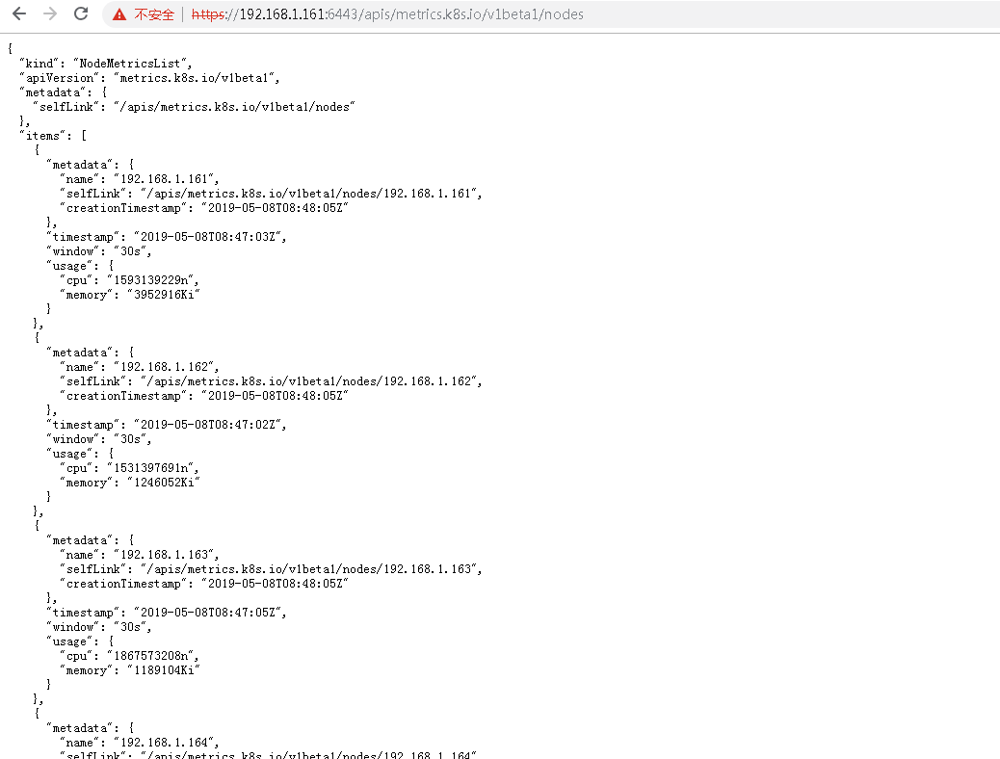

# Kubernetes系列之监控Metres-server实战篇

## 介绍

* 从Kubernetes1.8开始, Kubernetes通过Metrics API获取资源使用指标, 例如容器CPU和内存使用情况. 这些度量指标可以由用户直接访问, 例如通过使用kubectl top 命令，或者使用集群中的控制器。
* Metrics API: 通过Metrics API, 您可以获得node或pod当前的资源使用情况(但是不存储).
* 大致是说它符合kubernetes的监控架构设计, 受heapster项目启发, 并且比heapster优势在于：
    * 访问不需要apiserver的代理机制, 提供认证和授权等;
    * 很多集群内组件依赖它(HPA,scheduler,kubectl top), 因此它应该在集群中默认运行;

## 创建metrics-server证书

创建签名请求
```
[root@master01 ssl]# cd /etc/kubernetes/ssl
[root@master01 ssl]# more metrics-server-csr.json 
{
	"CN": "aggregator",
	"hosts": [],
	"key": {
		"algo": "rsa",
		"size": 2048
	},
	"names": [{
		"C": "CN",
		"ST": "Hangzhou",
		"L": "Hangzhou",
		"O": "k8s",
		"OU": "4Paradigm"
	}]
}
```

创建证书和私钥
```
[root@master01 ssl]# cfssl gencert -ca=/etc/kubernetes/ssl/ca.pem -ca-key=/etc/kubernetes/ssl/ca-key.pem -config=/etc/kubernetes/ssl/ca-config.json -profile=kubernetes metrics-server-csr.json|cfssljson -bare metrics-server
2019/05/08 16:39:29 [INFO] generate received request
2019/05/08 16:39:29 [INFO] received CSR
2019/05/08 16:39:29 [INFO] generating key: rsa-2048
2019/05/08 16:39:29 [INFO] encoded CSR
2019/05/08 16:39:30 [INFO] signed certificate with serial number 398547815685927963515918180669981460794904520195
2019/05/08 16:39:30 [WARNING] This certificate lacks a "hosts" field. This makes it unsuitable for
websites. For more information see the Baseline Requirements for the Issuance and Management
of Publicly-Trusted Certificates, v.1.1.6, from the CA/Browser Forum (https://cabforum.org);
specifically, section 10.2.3 ("Information Requirements").
```

同步证书到master02、master03
```
[root@master01 ssl]# scp -rp metrics-server-key.pem metrics-server.pem root@master02:/etc/kubernetes/ssl/
[root@master01 ssl]# scp -rp metrics-server-key.pem metrics-server.pem root@master03:/etc/kubernetes/ssl/
```

## 开启聚合配置

修改kube-apiserver配置文件来支持metres-server，加入如下启动参数来启用aggregation layer：
```
[root@master01 ssl]# cd /etc/kubernetes/
[root@master01 kubernetes]# more kube-apiserver 
KUBE_APISERVER_OPTS="--logtostderr=true \
--v=4 \
--etcd-servers=https://192.168.1.161:2379,https://192.168.1.162:2379,https://192.168.1.163:2379 \
--bind-address=192.168.1.161 \
--secure-port=6443 \
--advertise-address=192.168.1.161 \
--allow-privileged=true \
--service-cluster-ip-range=10.254.0.0/16 \
--enable-admission-plugins=NamespaceLifecycle,LimitRanger,ServiceAccount,ResourceQuota,NodeRestriction \
--authorization-mode=RBAC,Node \
--enable-bootstrap-token-auth \
--token-auth-file=/etc/kubernetes/token.csv \
--service-node-port-range=30000-50000 \
--tls-cert-file=/etc/kubernetes/ssl/server.pem \
--tls-private-key-file=/etc/kubernetes/ssl/server-key.pem \
--client-ca-file=/etc/kubernetes/ssl/ca.pem \
--service-account-key-file=/etc/kubernetes/ssl/ca-key.pem \
--etcd-cafile=/etc/etcd/ssl/ca.pem \
--etcd-certfile=/etc/etcd/ssl/server.pem \
--etcd-keyfile=/etc/etcd/ssl/server-key.pem \
--proxy-client-cert-file=/etc/kubernetes/ssl/metrics-server.pem \
--proxy-client-key-file=/etc/kubernetes/ssl/metrics-server-key.pem \
--runtime-config=api/all=true \
--requestheader-client-ca-file=/etc/kubernetes/ssl/ca.pem \
--requestheader-allowed-names=aggregator \
--requestheader-extra-headers-prefix=X-Remote-Extra- \
--requestheader-group-headers=X-Remote-Group \
--requestheader-username-headers=X-Remote-User"
```

* --requestheader-XXX、--proxy-client-XXX 是 kube-apiserver 的 aggregator layer 相关的配置参数，metrics-server & HPA 需要使用。
* --requestheader-client-ca-file：用于签名 --proxy-client-cert-file 和 --proxy-client-key-file 指定的证书；在启用了 metric aggregator 时使用。
* 如果 --requestheader-allowed-names 不为空，则--proxy-client-cert-file 证书的 CN 必须位于 allowed-names 中，默认为 aggregator。

> 注意：需要重启三台主控的kube-apiserver

如果不开启聚合配置可能会报如下错误
这是因为没用开启聚合层
```
I0313 05:18:36.447202 1 serving.go:273] Generated self-signed cert (apiserver.local.config/certificates/apiserver.crt, apiserver.local.config/certificates/apiserver.key)
Error: cluster doesn't provide requestheader-client-ca-file
```

## 创建metrics-server

```
[root@master01 kubernetes]# cd /root/kubernetes/yaml/metrics-server/
[root@master01 metrics-server]# kubectl apply -f .
clusterrole.rbac.authorization.k8s.io/system:aggregated-metrics-reader created
clusterrolebinding.rbac.authorization.k8s.io/metrics-server:system:auth-delegator created
rolebinding.rbac.authorization.k8s.io/metrics-server-auth-reader created
clusterrolebinding.rbac.authorization.k8s.io/metrics-server:system:kubelet-api-admin created
apiservice.apiregistration.k8s.io/v1beta1.metrics.k8s.io created
serviceaccount/metrics-server created
deployment.extensions/metrics-server created
service/metrics-server created
clusterrole.rbac.authorization.k8s.io/system:metrics-server created
clusterrolebinding.rbac.authorization.k8s.io/system:metrics-server created
```

## 测试功能

```
[root@master01 metrics-server]# kubectl top nodes
NAME            CPU(cores)   CPU%   MEMORY(bytes)   MEMORY%   
192.168.1.161   1594m        39%    3860Mi          50%       
192.168.1.162   1532m        38%    1216Mi          15%       
192.168.1.163   1868m        46%    1161Mi          15%       
192.168.1.164   629m         15%    561Mi           7%        
192.168.1.165   509m         12%    536Mi           6%        
[root@master01 metrics-server]# kubectl top pods --all-namespaces
NAMESPACE     NAME                                   CPU(cores)   MEMORY(bytes)   
default       nginx-57867cc648-47w9v                 0m           3Mi             
kube-system   coredns-5d668bd598-9lfhr               53m          15Mi            
kube-system   coredns-5d668bd598-wg6rr               32m          13Mi            
kube-system   kubernetes-dashboard-cb55bd5bd-lbmth   8m           15Mi            
kube-system   metrics-server-84f9775b88-zh58s        7m           14M
```


## 通过 kube-apiserver接口访问

```
https://192.168.1.161:6443/apis/metrics.k8s.io/v1beta1/nodes 
https://192.168.1.161:6443/apis/metrics.k8s.io/v1beta1/pods 
https://192.168.1.161:6443/apis/metrics.k8s.io/v1beta1/namespace/pods/
```

```
[root@master01 metrics-server]# curl -k https://192.168.1.161:6443/apis/metrics.k8s.io/v1beta1/nodes 
{
  "kind": "NodeMetricsList",
  "apiVersion": "metrics.k8s.io/v1beta1",
  "metadata": {
    "selfLink": "/apis/metrics.k8s.io/v1beta1/nodes"
  },
  "items": [
    {
      "metadata": {
        "name": "192.168.1.164",
        "selfLink": "/apis/metrics.k8s.io/v1beta1/nodes/192.168.1.164",
        "creationTimestamp": "2019-05-08T08:49:01Z"
      },
      "timestamp": "2019-05-08T08:48:01Z",
      "window": "30s",
      "usage": {
        "cpu": "493304205n",
        "memory": "576388Ki"
      }
    },
    {
      "metadata": {
        "name": "192.168.1.165",
        "selfLink": "/apis/metrics.k8s.io/v1beta1/nodes/192.168.1.165",
        "creationTimestamp": "2019-05-08T08:49:01Z"
      },
      "timestamp": "2019-05-08T08:48:02Z",
      "window": "30s",
      "usage": {
        "cpu": "557446019n",
        "memory": "549500Ki"
      }
    },
    {
      "metadata": {
        "name": "192.168.1.161",
        "selfLink": "/apis/metrics.k8s.io/v1beta1/nodes/192.168.1.161",
        "creationTimestamp": "2019-05-08T08:49:01Z"
      },
      "timestamp": "2019-05-08T08:48:03Z",
      "window": "30s",
      "usage": {
        "cpu": "1605375643n",
        "memory": "3957220Ki"
      }
    },
    {
      "metadata": {
        "name": "192.168.1.162",
        "selfLink": "/apis/metrics.k8s.io/v1beta1/nodes/192.168.1.162",
        "creationTimestamp": "2019-05-08T08:49:01Z"
      },
      "timestamp": "2019-05-08T08:48:03Z",
      "window": "30s",
      "usage": {
        "cpu": "1664100668n",
        "memory": "1246560Ki"
      }
    },
    {
      "metadata": {
        "name": "192.168.1.163",
        "selfLink": "/apis/metrics.k8s.io/v1beta1/nodes/192.168.1.163",
        "creationTimestamp": "2019-05-08T08:49:01Z"
      },
      "timestamp": "2019-05-08T08:48:05Z",
      "window": "30s",
      "usage": {
        "cpu": "1997679380n",
        "memory": "1191080Ki"
      }
    }
  ]
}
```



好了，进行到这，metrics就部署完了，敬请期待后续分享，谢谢！
